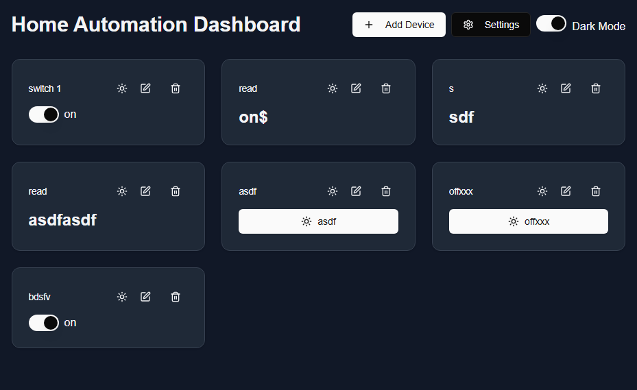

# Homator

A modern, intuitive MQTT-based home automation dashboard built with Next.js 14, Shadcn/UI, and TypeScript. Control and monitor your IoT devices in real-time with a clean, responsive interface.



## ✨ Features

- 🎛️ **Multiple Device Types**
  - Switches (ON/OFF control)
  - Buttons (Trigger actions)
  - Sliders (Numeric control)
  - Read-only displays (Sensor values)
- 🌐 **MQTT Integration**
  - Real-time communication
  - Support for multiple brokers
  - Secure WebSocket connections
- 🎨 **Modern UI/UX**
  - Dark/Light mode
  - Responsive design
  - Customizable icons
  - Clean, intuitive interface
- ⚡ **Performance**
  - Built on Next.js 14
  - Real-time updates
  - Optimized rendering

## 🚀 Getting Started

### Prerequisites

- Node.js 18.17 or later
- npm or yarn
- MQTT broker access

### Installation

1. Clone the repository:
git clone https://github.com/yourusername/homator.git
cd homator

2. Install dependencies:
npm install
# or
yarn install

3. Start the development server:
npm run dev
# or
yarn dev

4. Open [http://localhost:3000](http://localhost:3000) in your browser

## 📱 Usage

### Connecting to MQTT Broker

1. Click the Settings icon (⚙️) in the top right
2. Choose from preset brokers or enter custom details:
   wss://broker.emqx.io:8084/mqtt  (Default public broker)

### Adding Devices

1. Click "+ Add Device"
2. Configure your device:
   - Name: Descriptive name
   - Type: Switch/Button/Slider/Read
   - Topic: MQTT topic (e.g., "home/living/light")
   - Icon: Visual identifier
   - Device-specific settings

### Device Configuration

#### Switch
```json
{
  "type": "switch",
  "config": {
    "onMessage": "ON",
    "offMessage": "OFF"
  }
}
```

#### Button
```json
{
  "type": "button",
  "config": {
    "buttonMessage": "PRESS"
  }
}
```

#### Slider
```json
{
  "type": "slider",
  "config": {
    "min": 0,
    "max": 100,
    "unit": "%"
  }
}
```

#### Read
```json
{
  "type": "read",
  "config": {
    "unit": "°C"
  }
}
```

## 🛠️ Technology Stack

- **Frontend Framework**
  - [Next.js 14](https://nextjs.org/)
  - [React](https://reactjs.org/)
  - [TypeScript](https://www.typescriptlang.org/)

- **UI Components**
  - [Shadcn/UI](https://ui.shadcn.com/)
  - [Tailwind CSS](https://tailwindcss.com/)
  - [Lucide Icons](https://lucide.dev/)

- **MQTT Communication**
  - [MQTT.js](https://github.com/mqttjs/MQTT.js)

## 📁 Project Structure
```
homator/
├── app/                    # Next.js app directory
│   ├── layout.tsx         # Root layout
│   └── page.tsx           # Home page
├── components/            # React components
│   ├── ui/               # Shadcn UI components
│   ├── dashboard.tsx     # Main dashboard
│   └── device-dialog.tsx # Device configuration
├── lib/                  # Utilities
├── public/               # Static assets
└── types/                # TypeScript types
```
## 🤝 Contributing

We welcome contributions! Please follow these steps:

1. Fork the repository
2. Create your feature branch (`git checkout -b feature/AmazingFeature`)
3. Commit your changes (`git commit -m 'Add AmazingFeature'`)
4. Push to the branch (`git push origin feature/AmazingFeature`)
5. Open a Pull Request

## 📝 License

This project is licensed under the MIT License - see the [LICENSE](LICENSE) file for details.

## 🙏 Acknowledgments

- [EMQX](https://www.emqx.io/) for their public MQTT broker
- [Shadcn](https://twitter.com/shadcn) for the UI components
- [Vercel](https://vercel.com) for hosting

## 💬 Support

For support:
- Open an [issue](https://github.com/yourusername/homator/issues)
- Join our [Discord community](https://discord.gg/yourdiscord)
- Email: support@homator.com

## 🔮 Roadmap

- [ ] Device Groups
- [ ] Custom Themes
- [ ] Automation Rules
- [ ] Historical Data